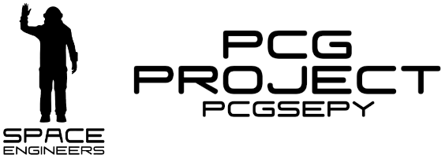
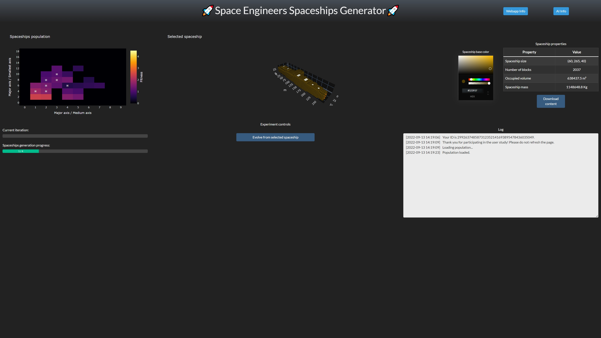
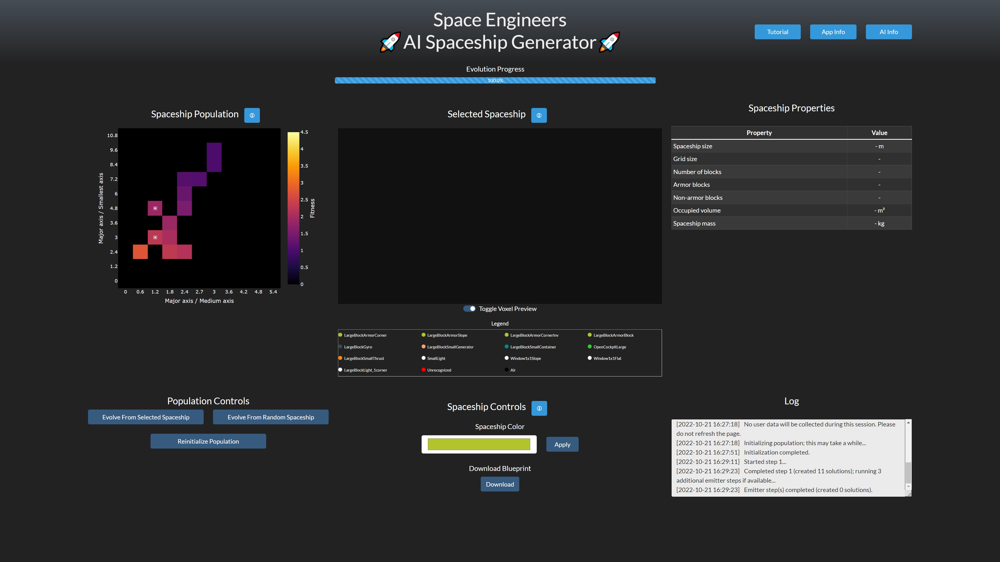
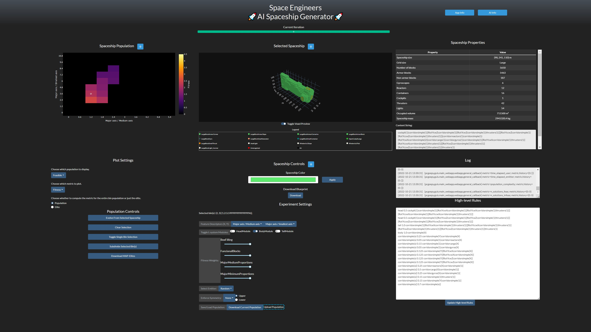
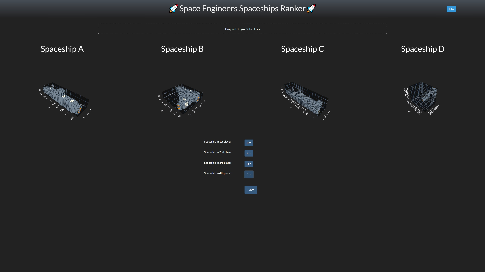

# 🚀 Space Engineers AI Spaceship Generator 🚀
[](https://opensource.org/licenses/MIT)


<p align="center">
  
</p>
Research code for the Space Engineers PCG project developed under the GoodAI research grant.

## Installation
The application can be built using the provided `.bat` files placed in the `user-study` folder. The executable files will be created in the `user-study\dist` folder.

You can build just the main web application (running `build_main_webapp.bat`) or also the spaceships ranker (running `build_comparator.bat`). Keep in mind that the latter is used only for the user study.

### Modifiable files
Some files can be modified before building the application. These are:
- the estimators under the `estimators` folders: these are `.pkl` files and can be generated by running the `steam-workshop-downloader\spaceships-analyzer.ipynb` notebook (additional details are provided in the notebook itself).
- the `configs.ini` file: different settings can be specified in this file, making sure to respect the setting formats specified in `pcgsepy\config.py`.
- `block_definitions.json`: this file can be excluded from the application building file (`user-study\build_main_webapp.bat`), but it is required to run the application. It can be recreated when the application is first launched if an instance of Space Engineers is open and the [iv4xr API](https://github.com/iv4xr-project/iv4xr-se-plugin) is installed.
- `hlrules`, `llrules`: these files define the expansion rules of the underlying L-system used in the application. `hlrules` determines the tile placements when creating spaceships, whereas `llrules` determines the game blocks used in a tile. If you want to add your own tiles in the application, please follow the instructions reported in `l-system\rules-extractor.ipynb` and remember to also update the `hl_atoms.json` file.

## How to use the webapp
All modes of the webapps have a handy "*Info*" button, but the following is a quick overview of how they work.

### Main webapp - user study mode
<p align="center">
  
</p>
This mode is used during the user study and allows only to evolve spaceships after selecting a valid bin. The user study has a predefined number of generations (iterations) allowed and spans different configurations of the MAP-Elites emitter. At the end of the user study, the application automatically switches over to `user mode`.

### Main webapp - user mode
<p align="center">
  
</p>
In this mode, the user is allowed to evolve spaceships indefinitely, choosing between evolving from the selected bin or running multiple steps of the random emitter at once. Additionally, the user is allowed to reset the population of solutions.

### Main webapp - developer mode
<p align="center">
  
</p>
This is the most advanced mode, giving the user full access to every part of the system that can be changed during the evolution process.

### Ranker webapp
<p align="center">
  
</p>
This webapp is used only for the user study and allows the user to upload and rank different spaceships.

## Development
Install the `PCGSEPy` library by first installing the requirements:
```
pip install -r requirements.txt
```
And then install the library:
```
pip install -e .
```

## Contents overview
- `pcgsepy`: this directory contains the main Python PCGSEPy library.
- `steam-workshop-downloader`: this directory contains the code used to download the spaceships from the Steam Workshop and extract the metrics of interest.
- `l-system`: this directory contains the code used for the L-system and FI-2Pop experiments.
- `icmap-elites`: this directory contains the code used for the Interactive Constrained MAP-Elites experiments and the user study.
- `user-study`: this directory contains additional code used in the user study.

For more information, refer to the `README`s in each directory.

## Publications
This library was used in the following publications:
> Roberto Gallotta, Kai Arulkumaran, and L. B. Soros. 2022. Evolving spaceships with a hybrid L-system constrained optimisation evolutionary algorithm. In Proceedings of the Genetic and Evolutionary Computation Conference Companion (GECCO '22). Association for Computing Machinery, New York, NY, USA, 711–714. https://doi.org/10.1145/3520304.3528775

> Gallotta, Roberto, Kai Arulkumaran, and L. B. Soros. ‘Surrogate Infeasible Fitness Acquirement FI-2Pop for Procedural Content Generation’. In 2022 IEEE Conference on Games (CoG), ?-?, CASIA, Beijing, China, 2022. 10.48550/arXiv.2205.05834.